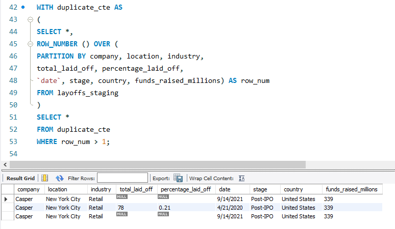
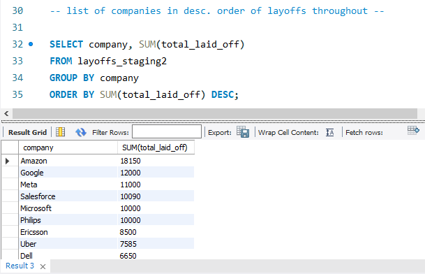
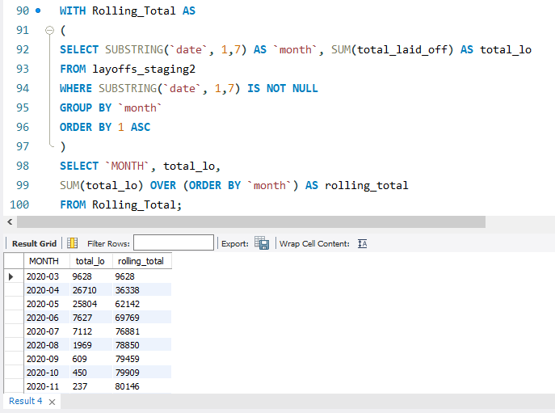
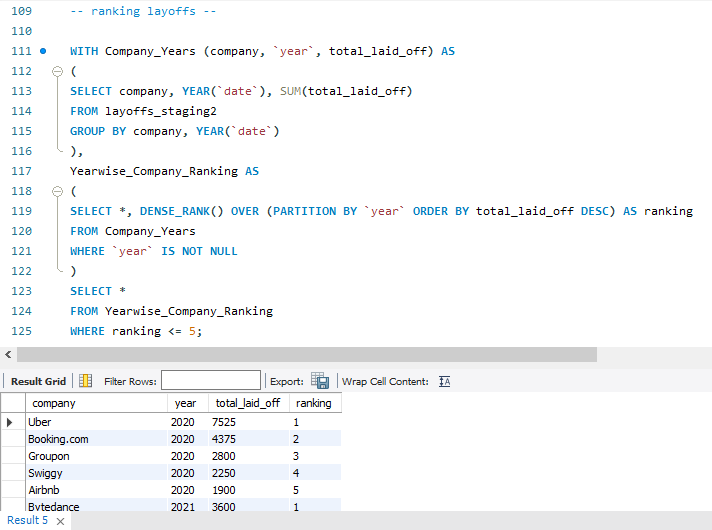

````md
# World Layoffs SQL Data Analysis Project

## Project Overview

This project focuses on cleaning and analyzing a real-world layoffs dataset using SQL.

The project is divided into two major phases:

1. Data Cleaning
2. Exploratory Data Analysis (EDA)

The goal of this project is to simulate a real-world data analyst workflow by transforming raw data into meaningful business insights using SQL.

---

# Dataset Information

Dataset: Layoffs Dataset

The dataset contains information related to:
- Company layoffs
- Industries
- Countries
- Funding raised
- Company stages
- Layoff percentages
- Dates of layoffs

---

# Tools Used

- MySQL
- SQL
- GitHub

---

# Project Structure

```text
sql-layoffs-analysis/
│
├── datasets/
│   └── layoffs.csv
│
├── data-cleaning/
│   └── layoffs_data_cleaning.sql
│
├── exploratory-data-analysis/
│   └── layoffs_eda.sql
│
├── screenshots/
│   ├── duplicate-removal.png
│   ├── top-companies.png
│   ├── rolling-total.png
│   └── yearly-layoffs.png
│
└── README.md
````

---

# Phase 1 — Data Cleaning

## Objective

The objective of this phase was to clean and standardize the raw dataset before performing analysis.

## Cleaning Steps Performed

* Created staging tables
* Removed duplicate records
* Standardized inconsistent values
* Trimmed unnecessary spaces
* Handled NULL and blank values
* Converted data types
* Removed unnecessary columns

## SQL Concepts Used

* CTEs
* Window Functions
* ROW_NUMBER()
* UPDATE statements
* DELETE statements
* String Functions
* Data Standardization

---

# Phase 2 — Exploratory Data Analysis (EDA)

## Objective

The objective of this phase was to analyze layoffs trends and generate meaningful business insights using SQL.

## Analysis Performed

* Companies with highest layoffs
* Industry-wise layoffs analysis
* Country-wise layoffs analysis
* Year-wise layoffs trends
* Companies with complete layoffs
* Rolling total layoffs over time
* Top companies by year ranking

## SQL Concepts Used

* GROUP BY
* Aggregate Functions
* Window Functions
* DENSE_RANK()
* CTEs
* Date Functions

---

# Key Business Insights

* Large tech companies experienced significant layoffs during economic downturns.
* The United States recorded the highest number of layoffs among all countries.
* Several companies laid off 100% of their workforce.
* Layoffs increased significantly during 2022 and 2023.
* Industries such as Consumer and Retail were heavily affected.

---

# Project Screenshots

## Duplicate Removal Using ROW_NUMBER()



---

## Top Companies by Total Layoffs



---

## Rolling Total Layoffs Trend



---

## Year-wise Company Layoff Rankings



---

# Learning Outcomes

Through this project, I learned:

* Real-world SQL data cleaning workflow
* Exploratory data analysis using SQL
* Data transformation techniques
* Working with window functions
* Writing structured SQL queries
* Organizing projects professionally on GitHub

---

# Future Improvements

* Create dashboards using Power BI or Tableau
* Perform advanced trend analysis
* Build automated SQL reporting workflows
* Add data visualizations

---

# Author

Vish

```
```
